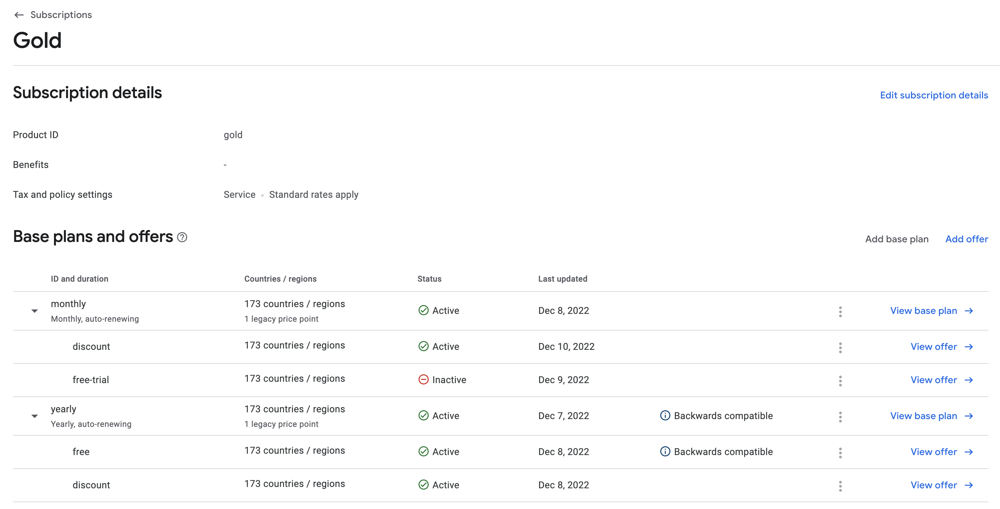

## Notes

Dashboard configuration




### Curl request to load gold subscription

```
curl -X 'GET' \
  'https://androidpublisher.googleapis.com/androidpublisher/v3/applications/com.mcastany.samplebc5/subscriptions' \
  -H 'accept: */*' \
  -H 'Authorization: Bearer {token}
```

[Response](./get_subscriptions.json)


### Curl request to load yearly offer

```
curl -X 'GET' \
  'https://androidpublisher.googleapis.com/androidpublisher/v3/applications/com.mcastany.samplebc5/subscriptions/gold/basePlans/yearly/offers' \
  -H 'accept: */*' \
  -H 'Authorization: Bearer {token}
```


[Response](./offers/get_gold_offer.json)
